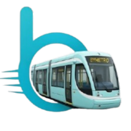

<p align="center">
  
</p>

# ByTrain 🚆 — Ultimate Train Tracking & Journey Planner

ByTrain is a modern, high-performance, and beautifully crafted Flutter application designed to track live train schedules, plan routes, view detailed station configurations, and navigate train networks seamlessly. Optimized with declarative state management, rich animations, and integrated maps, ByTrain delivers a premium, native-feeling utility experience.

The application follows the **Feature-First Clean Architecture** methodology and is strictly built upon industry-standard Flutter practices.

---

## ✨ Key Features

### 📍 Interactive Live Map & Tracking
*   **Google Maps Integration**: Seamless visual maps via `google_maps_flutter` pointing to live train locations (utilizing coordinate mapping for trains such as *Karakoram Express*, *Tezgam*, etc.).
*   **Location Services**: Integrated with `geolocator` and `permission_handler` to fetch the user's location and highlight nearby train routes.
*   **Custom Map Layers**: Cycle between classic, hybrid, satellite, and terrain maps with the click of a button.

### 📅 Intelligent Journey Planner
*   **Advanced Route Card**: Easy origin/destination station input with immediate swapping animation (and corresponding rotation effects).
*   **Temporal Planning**: Dynamic date & time selectors representing "Today", "Tomorrow", or customized schedules.
*   **Advanced Preferences**: Configure preference filters like *Fastest Route*, *Direct Only*, or *Cheapest First*.
*   **Fluid Search Simulations**: Premium loading feedback and detailed pricing, transit duration, and stop summaries for resulting routes.

### 🔍 Smart Autocomplete & Suggestion Overlays
*   **Glassmorphic Overlay Cards**: Typing in the search bar immediately brings up a custom blurred-glass suggestion panel showing popular trains and suggestions with ease.
*   **Direct Navigation**: Tapping a suggestion now takes you instantly to the train's detailed view, bypassing redundant search steps for a smoother experience.
*   **State-driven Sheets**: Uses high-performance nested `DraggableScrollableSheet` menus allowing users to swipe up to reveal live trains or swipe down to review map positions.

### 📊 Immersive Train Details & Timelines
*   **Live Status Banners**: Pulsing indicator badges representing on-time and delayed (with exact minutes delayed) states.
*   **Sliver AppBars**: Rich, high-contrast imagery headers with collapsing title animations and backdrop filtering.
*   **Interactive Timelines**: Vertical schedule progress trackers listing stations, arrival/departure schedules, platforms, delays, and current/passed/upcoming stop states.

### 🎨 State-of-the-Art UI/UX Design System
*   **Skeletonizer Loaders**: Replaces static, boring spinners with native-matching shimmering placeholders for card items, creating an elite perceived loading time.
*   **Centralized Design System**: Comprehensive dark and light mode themes via `ThemeData`, coupled with system haptic feedback and custom widgets.

---

## 🛠 Tech Stack

ByTrain is built with premium libraries from the Flutter/Dart ecosystem:

*   **Framework**: [Flutter](https://flutter.dev) (Dart SDK `^3.10.7`)
*   **State Management**: [flutter_bloc](https://pub.dev/packages/flutter_bloc) & [bloc](https://pub.dev/packages/bloc) (following clean event/state decoupling)
*   **Navigation**: [go_router](https://pub.dev/packages/go_router) (declarative, supporting deep links and stateful shell branches)
*   **Mapping & Location**: [google_maps_flutter](https://pub.dev/packages/google_maps_flutter), [geolocator](https://pub.dev/packages/geolocator), [permission_handler](https://pub.dev/packages/permission_handler)
*   **Image Handling**: [cached_network_image](https://pub.dev/packages/cached_network_image) (disk caching, loading progress, and error state placeholders)
*   **Utilities**: [equatable](https://pub.dev/packages/equatable) (for zero-boilerplate value comparison), [intl](https://pub.dev/packages/intl) (date formatting)
*   **Typography**: [google_fonts](https://pub.dev/packages/google_fonts)

---

## 🏗 Project Architecture

ByTrain implements **Feature-First Clean Architecture**, organizing source directories by independent business modules. This makes the code exceptionally clean, highly modular, testable, and effortless to scale.

```text
lib/
├── core/                       # Shared app configurations & global modules
│   ├── router/                 # GoRouter declarations & deep-link parameters
│   ├── theme/                  # Theme configurations (Colors, Custom Typography, Dimensions)
│   │   └── bloc/               # Global appearance & mode-switching BLoC
│   └── widgets/                # Reusable cross-feature UI components (Buttons, CustomCards, etc.)
├── features/                   # Independent modular features
│   ├── splash/                 # Entrance & asset initialization screens
│   ├── onboarding/             # Explanatory guides with PageView & slides
│   ├── home/                   # Main dashboard, user greetings, and recent journeys
│   ├── search/                 # Google Maps, autocomplete lists, and nearby train overlays
│   ├── train/                  # Train timelines, live schedules, and route sheets
│   ├── journey_planner/        # Transit calculations, preference chips, and search histories
│   ├── station/                # Station detailed lists, local facilities, and timetables
│   └── settings/               # Notifications, system appearance switches, and legal panels
└── main.dart                   # Root assembly, MultiBlocProviders, and startup configurations
```

---

## 🚀 Installation & Running

### Prerequisites

*   Flutter SDK installed (`^3.10.7` or later).
*   An Android / iOS device (or emulator) with Google Play Services enabled.
*   A valid **Google Maps API Key**.


### Step 1: Clone & Build

1.  **Clone the repository**:
    ```bash
    git clone https://github.com/RasZarky/by_train.git
    cd by_train
    ```
2.  **Retrieve pub dependencies**:
    ```bash
    flutter pub get
    ```
3.  **Launch the app**:
    ```bash
    flutter run
    ```

---

## 🆕 Recent Updates
*   **Optimized Search UX**: Tapping a suggestion in the search overlay now takes you directly to the Train Details page, eliminating unnecessary intermediate search steps.
*   **Map Navigation Improvements**: Refined the interaction between the search sheet and the interactive Google Maps view.

---

## 👨‍💻 Development Team

This application was engineered with care by:

*   **Abdul Razak Abubakari** (Mobile Developer)
    *   📧 Email: [ubdoolrazak@gmail.com](mailto:ubdoolrazak@gmail.com)
    *   🔗 GitHub: [RasZarky](https://github.com/RasZarky)
*   **Belal Mohamed** (Mobile Developer)
    *   📧 Email: [dixen.bugs@gmail.com](mailto:dixen.bugs@gmail.com)

---

## 🏢 Organization & Support

ByTrain is an official open-source endeavor supported by **Apexiums Technologies**.

*   🌐 **Website**: [apexiumstechnologies.com](https://apexiumstechnologies.com/)
*   📧 **Support**: [ammanm0789@gmail.com](mailto:ammanm0789@gmail.com)
*   📝 **License**: Distributed under Apexiums internal copyrights. See Settings → About within the application for more.
